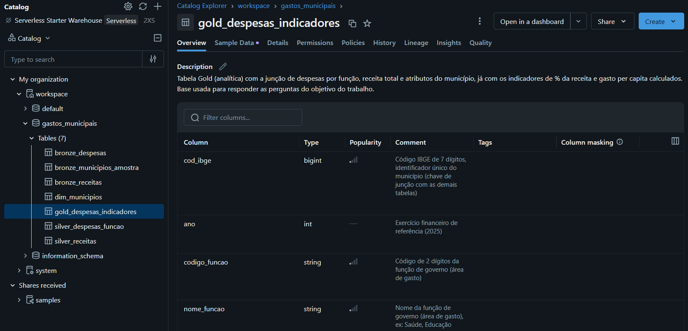
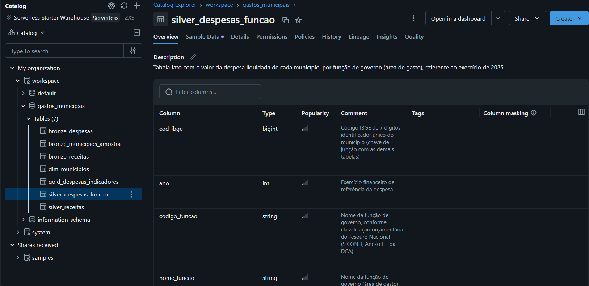
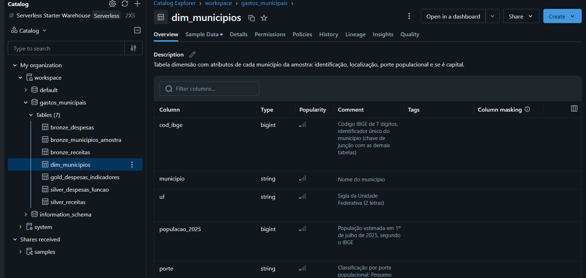
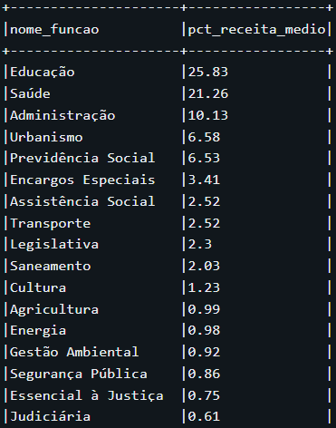
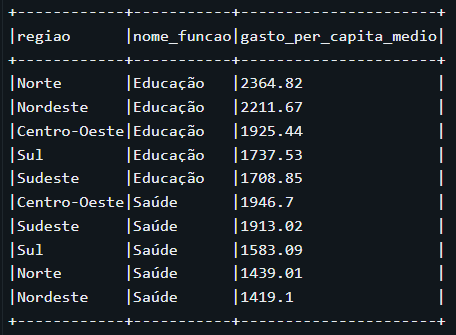
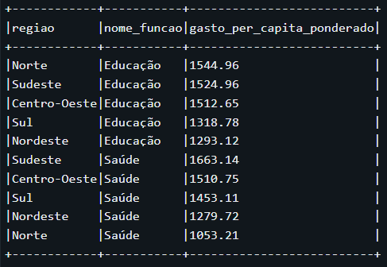
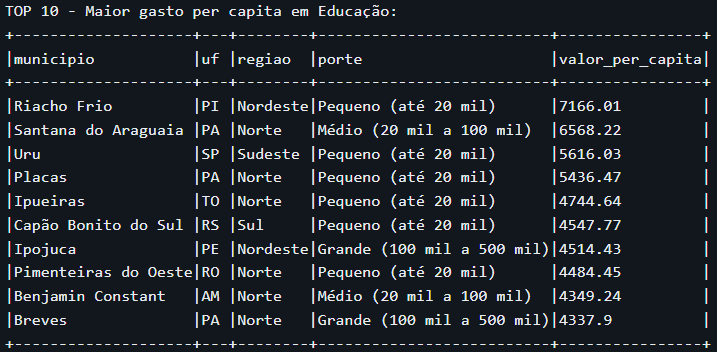
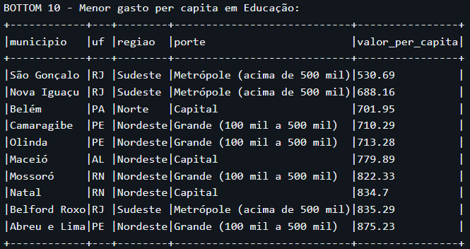
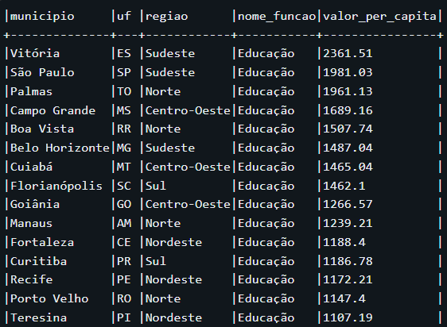
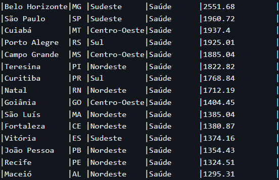

# MVP - Gastos e Investimentos das Prefeituras Brasileiras (2025)

## 1. Contexto de Negócio e Perguntas de Investigação
Este projeto investiga como as prefeituras brasileiras alocam seus gastos entre diferentes áreas de atuação (Educação, Saúde, Administração, Previdência Social, entre outras), em relação à sua receita total, tomando como referência o exercício de 2025.

O objetivo é entender padrões regionais e por porte de município, respondendo às seguintes perguntas de investigação:

1. Como se distribui o gasto per capita entre as diferentes áreas (funções de despesa), e quais delas concentram a maior parte da receita municipal?
2. Como o gasto per capita por região se comporta ao comparar a média simples entre municípios e a média ponderada pela população — e por que essas duas visões podem divergir?
3. Como o gasto per capita varia entre municípios de diferentes portes populacionais, incluindo um recorte específico para as capitais?

Não foi realizada, neste MVP, uma comparação entre os rankings de gasto per capita e o PIB municipal, dada a defasagem estrutural de publicação desse indicador pelo IBGE (dados mais recentes disponíveis referem-se a 2023) e o tempo disponível para o desenvolvimento do trabalho.

## 2. Coleta de Dados
Os dados foram coletados de duas fontes públicas oficiais:

- **SICONFI (Tesouro Nacional)**: API REST (`apidatalake.tesouro.gov.br/ords/siconfi/tt/dca`), a partir da Declaração de Contas Anuais (DCA) de 2025. Foram utilizados o Anexo I-E (Despesas por Função de Governo, métrica "Despesas Liquidadas") e o Anexo I-C (Receitas Brutas Realizadas).
- **IBGE**: API de localidades (`servicodados.ibge.gov.br`) para mapeamento de município, UF e região; e estimativas populacionais 2025, para cálculo dos indicadores per capita.

**Metodologia de amostragem**: como o Brasil possui 5.571 municípios e cada um exige uma chamada individual à API do SICONFI (o parâmetro `id_ente` é obrigatório, não havendo endpoint de consulta em lote), optou-se por uma amostra estratificada por porte populacional (Pequeno, Médio, Grande, Metrópole) cruzada com região, garantindo a inclusão total das 27 capitais (26 estados + DF). A amostra final totalizou 486 municípios, dos quais 478 permaneceram após a exclusão de 8 municípios sem retorno de dados de receita (ver seção de Qualidade de Dados).
Entre os 8 municípios excluídos está Brasília/DF, uma das 27 capitais originalmente incluídas na amostra. Dessa forma, a amostra analítica final (478 municípios) contempla 26 das 27 capitais brasileiras.

**Nota sobre continuidade do trabalho**: durante o desenvolvimento, houve um momento de confusão entre duas contas Databricks (pessoal e empresarial), que inicialmente pareceu indicar perda de dados. Ao identificar e acessar a conta correta, confirmou-se que todas as tabelas Bronze/Silver/Gold estavam intactas, e o trabalho prosseguiu normalmente dentro da plataforma Databricks, sem necessidade de reprocessamento.

## 3. Modelagem e Catálogo de Dados
O modelo de dados segue uma arquitetura em **Star Schema**, com uma tabela de dimensão (`dim_municipios`, contendo código IBGE, nome, UF, região, população 2025, porte populacional e indicador de capital) e tabelas de fato para despesas e receitas.

A implementação segue o padrão de arquitetura **Medallion** (Bronze / Silver / Gold), organizada como um único schema no Unity Catalog (`workspace.gastos_municipais`), com as camadas identificadas por prefixo no nome da tabela:

- **Bronze** (dados brutos, como retornados pelas APIs): `bronze_despesas`, `bronze_receitas`, `bronze_municipios_amostra`
- **Silver** (dados tratados e padronizados): `silver_despesas_funcao`, `silver_receitas`, `dim_municipios`
- **Gold** (dados prontos para análise, já com indicadores calculados): `gold_despesas_indicadores`

Todas as tabelas e suas colunas foram documentadas diretamente no Unity Catalog, via `COMMENT ON TABLE` e `ALTER TABLE ... ALTER COLUMN ... COMMENT`, funcionando como o catálogo de dados do projeto.

## 4. Pipeline de Dados (ETL)
O pipeline foi implementado em dois notebooks PySpark no Databricks, conectados ao repositório GitHub via Git folder:

- **`01_coleta_siconfi`**: realiza a extração (Extract) dos dados via APIs do SICONFI e do IBGE, aplica a lógica de amostragem estratificada e persiste os dados brutos como tabelas Delta na camada Bronze.
- **`02_modelagem_silver`**: realiza a transformação (Transform) dos dados — limpeza, padronização de colunas, tratamento de inconsistências (ver Qualidade de Dados) — criando as tabelas da camada Silver e a dimensão `dim_municipios`. Em seguida, realiza o cruzamento (join) entre despesas, receitas e a dimensão de municípios, calculando os indicadores per capita e percentuais, e persiste (Load) o resultado na tabela Gold `gold_despesas_indicadores`, usada como base para toda a análise.

Todo o código está versionado no repositório GitHub e sincronizado com o Databricks via Git folder, permitindo rastreabilidade completa das transformações aplicadas.

## 5. Qualidade de Dados
**Completude**: 8 dos 486 municípios da amostra não retornaram dados de receita na API do SICONFI. Um deles é Brasília-DF, que possui estrutura administrativa atípica (não é município tradicional); os outros 7 provavelmente ainda não haviam enviado a DCA de 2025 no momento da coleta. Esses 8 foram excluídos da amostra final (478 municípios).

**Consistência**: a API de localidades do IBGE retornou `microrregiao: None` para algumas entradas. Foi implementado um fallback usando `regiao-imediata.regiao-intermediaria.UF` para garantir que todo município tivesse uma região válida associada.

**Consistência semântica**: identificou-se a existência de dois campos de população nos dados: a estimativa IBGE 2025 e uma população embutida no próprio retorno da API do SICONFI. Não se trata de um valor incorreto, mas de dois campos com finalidades distintas — o segundo provavelmente utilizado para fins de cálculo do FPM. Para os indicadores per capita deste trabalho, foi utilizada a estimativa populacional do IBGE 2025, por ser a referência demográfica oficial mais atual.

**Unicidade**: verificado que a tabela `dim_municipios` não contém `cod_ibge` duplicado (0 ocorrências). Na tabela `gold_despesas_indicadores`, cuja granularidade é município x função de despesa, confirmou-se que a combinação (`cod_ibge`, `codigo_funcao`) também não apresenta duplicatas.

**Outliers**: aplicou-se o método do intervalo interquartil (IQR) sobre a variável `valor_per_capita`. O cálculo global apontou 1.092 linhas (~14% do total) como outliers, mas por misturar municípios de portes muito distintos, o limite ficou artificialmente baixo. Refazendo o cálculo com IQR por porte populacional (Window Function particionada por `porte`), o total caiu para 1.001 linhas, concentradas majoritariamente em municípios pequenos — consistente com o efeito de custo fixo já identificado na análise (poucos habitantes dividindo uma estrutura mínima de prefeitura). Entre as capitais, também houve 66 ocorrências, refletindo heterogeneidade institucional real (ex.: divisão federativa de responsabilidades entre estado e município no Rio de Janeiro, e diferentes graus de maturidade dos regimes próprios de previdência - RPPS) — não erros de dado.

## 6. Análise de Dados
### Pergunta 1 — Distribuição do gasto per capita entre áreas

Educação e Saúde concentram as maiores fatias do gasto municipal na amostra analisada, resultado compatível com a relevância orçamentária das áreas sujeitas a pisos constitucionais de aplicação de receita. Juntas, as funções de despesa mapeadas explicam cerca de 91,3% da receita total dos municípios da amostra.

Ao recortar os 5 maiores gastos por porte de município, observa-se que a participação da **Previdência Social** no orçamento cresce conforme aumenta o porte do município. Uma hipótese para esse comportamento é a maior presença ou maturidade de Regimes Próprios de Previdência Social (RPPS) em municípios de maior porte, frente a uma possível maior dependência do INSS (Regime Geral) em municípios pequenos — hipótese que não foi testada diretamente com os dados coletados.

### Pergunta 2 — Média simples vs. média ponderada por população, por região

Na amostra analisada (478 municípios), a comparação entre o gasto per capita médio por região usando média simples entre municípios e média ponderada pela população produz ordenações regionais diferentes. Uma explicação plausível é um efeito de custo fixo: uma estrutura mínima de prefeitura (equipe, manutenção, serviços básicos) precisa existir independentemente do tamanho da população, o que tende a elevar o gasto per capita em municípios menores — que dominam a média simples. Já a média ponderada reflete mais o comportamento dos municípios grandes, que concentram a maior parte da população de cada região. Como o resultado é da amostra e não de um censo dos 5.571 municípios, essas ordenações devem ser lidas como um retrato da amostra, não como conclusão definitiva sobre todas as regiões brasileiras.

No recorte de capitais, chama atenção o caso do **Rio de Janeiro**, que aparece com gasto per capita comparativamente baixo em Saúde e Educação. Uma hipótese explicativa é a divisão federativa da oferta desses serviços, que pode fazer com que parte da despesa esteja registrada no governo estadual em vez do municipal — hipótese de contexto, não verificada diretamente nos dados coletados.

### Pergunta 3 — Gasto per capita por porte de município (com recorte de capitais)

Os maiores gastos per capita da amostra estão concentrados em municípios pequenos, resultado compatível com a hipótese de efeito de custo fixo mencionada acima. Já entre os menores gastos per capita, destacam-se municípios da Baixada Fluminense (como São Gonçalo, Nova Iguaçu e Belford Roxo) e grandes municípios de Pernambuco. Esse comportamento pode estar relacionado, entre outros fatores, à dinâmica per capita decrescente das transferências do FPM (Fundo de Participação dos Municípios) para municípios maiores — hipótese não testada diretamente neste trabalho, mas que poderia ser incorporada em uma extensão futura da análise.

## 7. Autoavaliação
O que eu mais valorizei realizando esta MVP é que eu tinha um entendimento de que o Engenheiro de Dados atuava muito mais na infraestrutura de dados, modelando e preparando as bases para os cientistas e analistas realizarem o trabalho. Por esse entendimento, eu me "afastava" da engenharia de dados. Realizando este MVP, pude entender que o Engenheiro de Dados também pode fazer parte do processo de tomada de decisão, trabalhando na busca de respostas para as perguntas de negócio.

Como dificuldade técnica, com certeza foi o aprendizado de Python. Eu ainda não domino a linguagem, então tive algumas dificuldades de entendimento e de busca das funções necessárias para o tratamento dos dados. Além dessa dificuldade, em um determinado momento, ao voltar para continuar o trabalho, loguei no Databricks e todo o meu trabalho parecia ter sumido; e, após recuperá-lo, meu limite de uso havia chegado ao fim. Como eu tinha os notebooks salvos no GitHub, pensei na alternativa de fazer todo o ETL no Google Colab. Fiquei bastante frustrado e decidi voltar à MVP no dia seguinte. Ao logar novamente no Databricks, percebi que havia criado uma conta pessoal e outra empresarial, sendo esta última sem limite de uso atingido, e consegui seguir normalmente com a realização do trabalho.

Esse incidente me mostrou, na prática, a importância de manter backups e de salvar as versões do código no Git/GitHub.

Uma decisão importante que precisei tomar foi sobre a amostragem dos municípios. Pela estimativa de tempo de extração via API, coletar os dados completos de todos os municípios levaria cerca de 3 horas. Por isso, optei por estratificar os municípios por porte populacional e coletar uma amostra de cada estrato.

Outra decisão importante foi não incluir, nesta MVP, a comparação dos gastos por área em relação ao PIB médio dos municípios, dado o tempo que essa etapa adicional demandaria. Além disso, os dados de PIB municipal disponíveis eram referentes a 2023, o que não "conversava" adequadamente com os dados de gastos, referentes a 2025.
